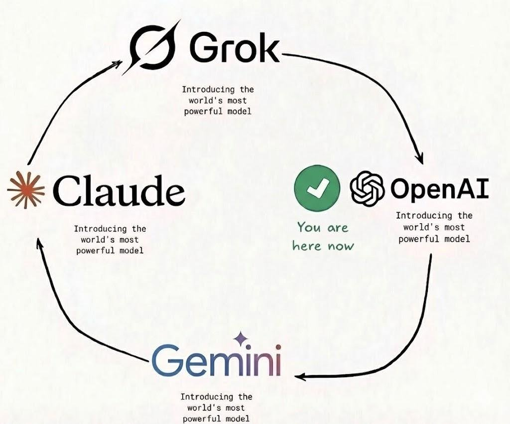

# Chatten

> Decentralized Exchange for AI Compute Tokens on Neo N3

Chatten is a next-generation decentralized marketplace that bridges AI compute resources with blockchain tokenomics. It enables AI agents to autonomously buy, sell, and trade compute capacity based on real-time performance metrics, powered by the Neo N3 blockchain and SpoonOS agent framework.



---

## Vision

The AI compute economy is fragmented. Model providers charge varying rates with opaque pricing, and consumers have no way to verify quality before paying. **Chatten solves this** by creating a transparent, performance-backed token economy where:

- **AI compute capacity is tokenized** as NEP-11 semi-fungible tokens
- **Quality is measurable** through the Q-Score system (0-100 composite metric)
- **Pricing is fair** because tokens are only minted when models meet quality thresholds
- **Trading is autonomous** with AI agents that execute orders based on on-chain data

### Who Is This For?

| User Type | Use Case |
|-----------|----------|
| AI Model Providers | Tokenize compute capacity and earn GAS based on performance |
| Compute Consumers | Purchase verified, quality-rated AI compute credits |
| Liquidity Providers | Trade compute tokens on the DEX for profit |
| AI Agents | Autonomously manage portfolios of compute tokens |

---

## Key Features

- **Autonomous AI Trader Agent** - SpoonOS-powered agent that monitors prices and executes trades
- **Performance-Based Tokenomics** - Q-Score system determines token value and minting eligibility
- **NEP-11 Smart Contract** - Semi-fungible tokens representing compute capacity
- **Zero-Gas Monitoring** - Read-only price checks via `test_invoke` (no gas cost)
- **SpoonOS Integration** - Full compatibility with the SpoonOS agent framework

---

## Architecture

```
                    ┌─────────────────────────────────────────────────────────┐
                    │                 ChattenTraderAgent                       │
                    │            (SpoonOS ToolCallAgent + GPT-4)              │
                    └─────────────────────┬───────────────────────────────────┘
                                          │
                          ┌───────────────┼───────────────┐
                          ▼               ▼               ▼
                   ┌──────────────┐ ┌──────────────┐ ┌──────────────┐
                   │PriceCheckTool│ │BuyComputeTool│ │QScoreAnalyzer│
                   │ (test_invoke)│ │   (invoke)   │ │    Tool      │
                   └──────┬───────┘ └──────┬───────┘ └──────────────┘
                          │                │
                          └───────┬────────┘
                                  ▼
┌─────────────────────────────────────────────────────────────────────────────────┐
│                        Neo N3 Blockchain (TestNet/MainNet)                      │
│  ┌───────────────────────────────────────────────────────────────────────────┐  │
│  │                      Chatten Contract (NEP-11)                             │  │
│  │  • mint()              • buy_compute()        • sell_compute()             │  │
│  │  • transfer()          • burn()               • update_price_oracle()      │  │
│  │  • get_current_price() • onNEP17Payment()     • claim_ownership()          │  │
│  └───────────────────────────────────────────────────────────────────────────┘  │
└─────────────────────────────────────────────────────────────────────────────────┘
```

### Project Structure

```
chatten/
├── agents/                    # SpoonOS Agent Implementations
│   ├── __init__.py
│   └── chatten_trader.py      # Autonomous Trader Agent (PriceCheckTool, BuyComputeTool)
├── contracts/                 # Neo N3 Smart Contracts
│   ├── __init__.py
│   └── chatten_token.py       # NEP-11 Compute Token Contract
├── tools/                     # SpoonOS Tools (Agent-Blockchain Bridge)
│   ├── __init__.py
│   ├── neo_bridge.py          # Core Neo N3 RPC Bridge
│   ├── token_tools.py         # Token Balance & Transfer Tools
│   └── market_tools.py        # Q-Score Analysis Tools
├── tests/                     # Test Suite
│   ├── conftest.py            # Pytest fixtures and mocks
│   ├── test_agent.py          # Agent tool tests
│   ├── test_contract.py       # Contract constant tests
│   └── test_tools.py          # SpoonOS tool tests
├── main.py                    # Application Entry Point
├── pyproject.toml             # Project Configuration
└── .env.example               # Environment Template
```

---

## Q-Score System

The Quality Score (Q-score) is a composite metric (0-100) that determines the fair market value of Compute Tokens based on real-time performance data.

### Scoring Components (25 points each)

| Component | Weight | Measures |
|-----------|--------|----------|
| Latency | 25% | Response time efficiency |
| Throughput | 25% | Processing capacity (tokens/second) |
| Quality | 25% | Accuracy & benchmark performance |
| Reliability | 25% | Uptime & error rates |

### Detailed Thresholds

| Component | Excellent (1.0) | Good (0.8) | Acceptable (0.6) | Fair (0.4) | Poor (0.2) | Fail (0.0) |
|-----------|-----------------|------------|------------------|------------|------------|------------|
| **Latency** | < 50ms | < 100ms | < 200ms | < 500ms | < 1000ms | >= 1000ms |
| **Throughput** | >= 1000 tps | >= 500 tps | >= 200 tps | >= 100 tps | >= 50 tps | < 50 tps |
| **Uptime** | >= 99.9% | >= 99% | >= 95% | >= 90% | < 90% | - |
| **Error Rate** | 0% | <= 1% | <= 5% | < 10% | >= 10% | - |

### Minting Rules

| Q-Score | Status | Token Minting |
|---------|--------|---------------|
| >= 80 | Excellent | Eligible for premium rates |
| >= 60 | Good | Standard minting enabled |
| >= 50 | Threshold | Minimum for minting |
| < 50 | Below Threshold | **Not eligible** - improvements needed |

---

## Quick Start

### Prerequisites

- Python 3.8+
- [uv](https://github.com/astral-sh/uv) (recommended) or pip
- Neo N3 wallet (TestNet for development)
- OpenAI API key (for agent LLM)

### Installation

```bash
# Clone the repository
git clone https://github.com/chatten/neo-chatten.git
cd neo-chatten

# Create virtual environment and install dependencies
uv sync

# Or with pip
pip install -e ".[dev]"
```

### Configuration

```bash
# Copy environment template
cp .env.example .env

# Edit with your credentials
nano .env
```

Required environment variables:

| Variable | Description | Required |
|----------|-------------|----------|
| `NEO_PRIVATE_KEY` | Your Neo N3 wallet private key (WIF format) | Yes |
| `NEO_RPC_URL` | Neo N3 RPC endpoint (default: `http://localhost:50012`) | No |
| `OPENAI_API_KEY` | OpenAI API key for agent LLM | Yes |
| `SPOON_API_KEY` | SpoonOS API key | Optional |

### Running

```bash
# Run the Chatten trader agent
python main.py

# Or via the installed command
chatten
```

---

## Components

### ChattenTraderAgent

The core AI agent that monitors prices and executes trades autonomously:

```python
from agents.chatten_trader import ChattenTraderAgent

# Initialize the agent with your configuration
agent = ChattenTraderAgent(
    contract_hash="0x1234...abcd",  # Your deployed contract hash
    rpc_url="http://localhost:50012",
    private_key="your-wif-private-key"
)

# Run the agent with a trading prompt
response = await agent.run(
    "Check the price of 'gpt-4'. If it is below 1,000,000, BUY 2.0 GAS worth of credits."
)
```

### PriceCheckTool (Zero-Gas Monitoring)

Check on-chain prices without paying gas:

```python
from agents.chatten_trader import PriceCheckTool

# Initialize the price check tool
price_tool = PriceCheckTool(
    contract_hash="0x1234...abcd",
    rpc_url="http://localhost:50012"
)

# Get current price (read-only, no gas cost)
price = await price_tool.get_price("gpt-4")
print(f"Current price: {price}")
```

### BuyComputeTool (Execute Trades)

Execute buy orders by transferring GAS to the contract:

```python
from agents.chatten_trader import BuyComputeTool

# Initialize the buy tool with signing capability
buy_tool = BuyComputeTool(
    contract_hash="0x1234...abcd",
    rpc_url="http://localhost:50012",
    private_key="your-wif-private-key"
)

# Buy 2.0 GAS worth of gpt-4 credits
result = await buy_tool.buy_credits("gpt-4", gas_amount=2.0)
if result["success"]:
    print(f"Transaction hash: {result['tx_hash']}")
```

### QScoreAnalyzerTool

Analyze AI model performance and calculate Q-Scores:

```python
from tools.market_tools import QScoreAnalyzerTool, PerformanceMetrics

# Initialize the analyzer
analyzer = QScoreAnalyzerTool()

# Calculate Q-Score with metrics
metrics = PerformanceMetrics(
    avg_latency_ms=45.0,
    tokens_per_second=1200.0,
    accuracy_score=0.95,
    benchmark_score=85.0,
    uptime_percentage=99.95,
    error_rate=0.002
)

result = await analyzer.calculate_q_score("gpt-4", metrics=metrics)
print(f"Q-Score: {result.q_score}")
print(f"Mint Eligible: {result.mint_eligible}")
print(f"Recommendations: {result.recommendations}")
```

---

## Smart Contract

### Chatten Token (NEP-11)

Semi-fungible token representing AI compute capacity.

| Property | Value |
|----------|-------|
| Symbol | `COMPUTE` |
| Decimals | 8 |
| Standard | NEP-11 (Semi-Fungible) |

### Contract Functions

#### Token Operations

| Function | Description | Gas Required |
|----------|-------------|--------------|
| `symbol()` | Returns token symbol ("COMPUTE") | No (read-only) |
| `decimals()` | Returns decimals (8) | No (read-only) |
| `totalSupply()` | Returns total token supply | No (read-only) |
| `balanceOf(owner)` | Returns balance for address | No (read-only) |
| `tokensOf(owner)` | Returns token IDs owned | No (read-only) |
| `transfer(to, token_id, data)` | Transfer token ownership | Yes |

#### DEX Operations

| Function | Description | Gas Required |
|----------|-------------|--------------|
| `get_current_price()` | Get current price | No (read-only) |
| `buy_compute(model_id)` | Buy compute credits (via onNEP17Payment) | Yes |
| `sell_compute(token_id, amount)` | Sell compute credits for GAS | Yes |

#### Admin Operations

| Function | Description | Access |
|----------|-------------|--------|
| `claim_ownership()` | Claim admin ownership (first call only) | Contract owner |
| `set_oracle(address)` | Set price oracle address | Admin only |
| `set_minter(address)` | Set minter address | Admin only |
| `pause()` | Pause contract operations | Admin only |
| `resume()` | Resume contract operations | Admin only |
| `update_price_oracle(price)` | Update price from oracle | Oracle only |
| `mint(to, model_id, q_score, units)` | Mint new tokens | Minter only |

### Post-Deployment Setup

After deploying the contract:

1. **Claim Ownership** (first transaction):
   ```python
   # The deployer must call claim_ownership() first
   await facade.invoke(contract_hash, "claim_ownership", [], signers=[deployer_account])
   ```

2. **Set Oracle Address**:
   ```python
   await facade.invoke(contract_hash, "set_oracle", [oracle_address], signers=[admin_account])
   ```

3. **Set Minter Address**:
   ```python
   await facade.invoke(contract_hash, "set_minter", [minter_address], signers=[admin_account])
   ```

---

## Development

### Testing

```bash
# Run all tests
uv run pytest

# Run with coverage report
uv run pytest --cov=. --cov-report=html

# Run specific test file
uv run pytest tests/test_agent.py -v

# Run only unit tests (skip contract tests requiring neo3-boa)
uv run pytest -k "not contract"
```

### Linting

```bash
# Run ruff linter
ruff check .

# Format with black
black .

# Type checking
mypy .
```

### Contract Compilation

```bash
# Install neo3-boa (smart contract compiler)
pip install neo3-boa

# Compile smart contract
neo3-boa compile contracts/chatten_token.py
```

---

## API Reference

### Classes

| Class | Module | Description |
|-------|--------|-------------|
| `ChattenTraderAgent` | `agents.chatten_trader` | Autonomous trading agent |
| `PriceCheckTool` | `agents.chatten_trader` | Zero-gas price monitoring |
| `BuyComputeTool` | `agents.chatten_trader` | Execute buy orders |
| `NeoBridgeTool` | `tools.neo_bridge` | Core Neo N3 RPC bridge |
| `TokenBalanceTool` | `tools.token_tools` | Query token balances |
| `TokenTransferTool` | `tools.token_tools` | Execute token transfers |
| `QScoreAnalyzerTool` | `tools.market_tools` | Calculate Q-Scores |
| `PerformanceMetrics` | `tools.market_tools` | Performance data container |
| `QScoreResult` | `tools.market_tools` | Q-Score calculation result |

### Configuration Classes

| Class | Module | Description |
|-------|--------|-------------|
| `NeoConfig` | `tools.neo_bridge` | Neo N3 connection settings |
| `TransactionResult` | `tools.neo_bridge` | Transaction result data |
| `TokenInfo` | `tools.token_tools` | Token metadata |
| `MarketAnalysis` | `tools.market_tools` | Market-wide analysis |

---

## License

MIT License - see [LICENSE](LICENSE) for details.

## Contributing

Contributions welcome! Please read our contributing guidelines first.

---

Built with Neo N3 (https://neo.org) and SpoonOS (https://spoonos.ai)
